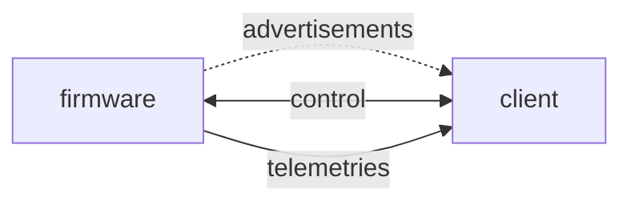

# BLE interactions with ST firmware

This document describes how microcontroller firmware from ST interacts with clients like mobile, desktop or gateway applications over Bluetooth Low Energy (BLE).

ST has been publishing a proprietary protocol that runs over standard BLE, named Blue ST SDK, which is publicly available on [github](https://github.com/STMicroelectronics/BlueSTSDK_Android/blob/master/BlueST-SDK.md).

BlueST SDK defines 1) a proprietary advertisement frame format and 2) proprietary characteristics to carry both commands and responses (control plane) as well as firmware generated data (telemetries).

During the years, the many available characteristics have been used in different ways, resulting in high fragmentation and a consequent difficulty for client devices to support different types of interaction styles implemented by multiple firmware teams.

Therefore this documents presents the recommended way to implement firmware and client apps interactions for typical features. 

## Identifying the BLE target
A client can understand the board type and the firmware that runs on it by looking at two bytes in the proprietary BLE advertisement frame. This bytes are named "board_id" and "firmware_id".

Given these two bytes, a client can get a full description of the board/firmware capabilities by looking up the corresponding entry in a so-called "firmware catalog", whose structure is described in a later section.

Whenever a new firmware is developed for an ST evaluation board, a web application is available to enter its description in the catalog; the web app guides firmware developer to enter all necessary information and performs all necessary checks before its final publication.

Before a new firmware is published, the reserved value `0xFF` should be used as firmware_id.

## Reporting device status

BlueST SDK allows firmware to use three bytes in the advertisement frame to carry device information and status. This is useful as it does not require the client to create a BLE connection with the device to get status info. The interpretation of these three firmware-dependent bytes can be found in the catalog description of the firmware.

Typical option bytes usages are: 1) an integer that can optionally be scaled, 2) an enumeration string, 3) an icon.

## Proprietary BLE characteristics
BlueST SDK defines many proprietary characteristics, tipically to send sensor data like accelerometer, gyroscope, pressure, temperature, but also data that is calculated on the target device like FFT, NanoEdgeAI, neural network output and so on. 

On top of the above characteristics, which are typically read-only, there are some other ones that are used to perform general purpose functions like firmware update, sending the configuration of smart sensors (.ucf files), etc.

* `Debug console`: used for different purposes, especially FOTA, but also .ucf files
* `Extended configuration`: used to support FOTA or sending custom commands to the firmware
* `General purpose`: this can carry different types of data as a telemetry
* `MLC output`: telemetry for Machine Learning Core (up to 8 output registers)
* `FSM output`: telemetry for Finite State Machine
* `ISPU output`: telemetry for Intelligent Sensor Processor Unit (requires json file to parse it)
* `STREDL output`: deprecated (STREDL is the previous name of ISPU)
* `Binary content`: used to carry binary files in both directions, includes segmentation and reassembly protocol for long payloads
* `RawTelemetry`: configurable characteristic, whose format is defined in specific component of a device model; also known as "slow telemetries"
* `PnPL`: "Plug-'n-Play Like" commands and responses as defined in the [device model](#device-models); PnPL is a simplified representation of Microsoft Plug and Play messages, in JSON format

## Sending heterogeneous telemetries
Typically, one characteristics carries one type of data only. There are situations, though, where telemetry data format can vary over time. Smart sensors with MLC or ISPU generate outputs whose format and meaning depend on the program that has been loaded.

## Firmware catalog

The firmware catalog is available in this public repository in [github](https://github.com/STMicroelectronics/appconfig) and contains information about firmware, boards, device models and much more. It is is available as a [big JSON file](https://github.com/STMicroelectronics/appconfig/blob/release/bluestsdkv2/catalog.json), which is updated whenever new firmware versions are published by ST, to be used on evaluation boards.

==> `Board decorator` to be explained

## Device models
Device models describe firmware capabilities in a machine readable form. They are encoded using a special JSON format, named [DTDL](https://azure.github.io/opendigitaltwins-dtdl/DTDL/v3/DTDL.v3.html) (Digital Twins Description Language). 

In particular, they describe the following device features:
* Telemetry 
* Properties
* Commands

ST defines a set of rules to structure device models in such a way that they can later be used for different purposes. In fact, an ST compliant device model can be used to:
1. generate C code to handle communication between a client and a device
2. generate dynamic user interfaces in mobile and Python GUI applications
3. drive the interpretation of heterogeneous telemetries

# Recommendations

## Device models and PnPL
Firmware should use device models and PnPL to ease integration with clients, whenever possible. PnPL refers to the capability to use commands and properties defined in the device model in the local interaction between client and device. This interaction can be implemented over BLE, USB or other types of connectivity links. In any case, PnPL messages define a well structured JSON payload.

Usage of device models is not mandatory but is highly recommended. Device models must follow conventions defined in this document.

Support for firmware that does not have a device model associated may be terminated in the future for such clients and systems as ST BLE Sensor mobile app and cloud dashboards. The transition between current systems and future ones in not described in this document.

## FOTA
The recommended way to implement firmware update is the following:
1. send a PnPL command to indicate that a FOTA procedure is about to start, use command parameters to specify payload size, CRC and other needed values.
2. use the `binary content` characteristic to trasfer the actual binary file content

After sending the PnPL command to start FOTA, the client should wait for a positive response, because it can take time for the firmware to erase flash memory.

FOTA using debug console is deprecated and its support will be removed in future version of clients.

* WB/WBA case must be defined

## Smart sensors
MLC and ISPU must be programmed before they can be used; there are two possible situations: 1) the microcontroller firmware has the smart sensor configuration hardcoded, 2) the smart sensor is programmed at runtime by sending a .ucf file content.

The status of MLC or ISPU is defined as a readonly property in the device model, along with the name of the program that has been loaded and the class labels to be associated with their outputs.
Loading a new .ucf file is achieved by a procedure similar to the one described above for the FOTA. First a command is sent to prepare the firmware to receive the .ucf file; second the content of the file is transferred using the binary content characteristic.

.ucf files start with comments where information about output registers and classes is defined. It is the responsibility of the microcontroller firmware to parse such comments and set properties that can then be accessed by clients using PnPL.

For firmware that does not have an associated device model, the MLC ot ISPU characteristics should be used instead (???).

Once programmed, smart sensors send their output on the MLC and ISPU characteristics.

## Heterogeneous telemetry data

Whenever a firmware must send data to a client and the type and format of such data can vary, the `RawTelemetry` characteristics should be used, as described above.

## Support for mobile apps

Mobile apps may want to 

## Open points
1. WB/WBA FOTA procedure
2. ISPU output configuration
3. ISPU .ucf file comments

## Summary of deprecated methods

| Function | Old characteristic (deprecated)| (replace with) New characteristic |
|----------|-------------------|--------------------|
| FOTA     | Debug console + Ext.conf | Binary content + PnPL |
| .ucf     | Debug console or PnPL compressed param| Binary content + PnPL |
| Dynamic content| General purpose | Raw telemetry + PnPL/ISPU JSON |

### Conventions

* `RawTelemetry`: the device model must have one or more components that declare a `st_ble_stream` property; this property is an object whose fields describe the format of the  of data carried within the `RawTelemetry` characteristic
* `Binary content`: 
    * client to firmware: the device model must declare a command that notifies the firmware that binary content will be transferred from the client to the device; this command must have parameters to indicate th type of encoding for the binary content
    * firmware to client: ???
* `MLC`: the device model must have one component for each device that embeds an MLC IP; this component specifies whether the MLC is programmed or not, the name of the program and the labels used to interpret MLC output
* `ISPU`: 

### Device model standard components
* Controllers
    * log controller (control datalogging firmware)
    * tags (allows adding tags to data being logged)
    * ble_telemetry (sending low bandwidth data over ble)
    * mobile app (configuring mobile app visualizations)
    * fota (firmware update)
* Algorithms
    * neural network
    * preprocessing
    * fft
    * mfcc
    * MLC (configuration and output telemetry)
    * ISPU (configuration and output telemetry)
* Sensors
    * accelerometer_ism330dhcx
    * accelerometer_lsm6dsox
    * gyroscope_ism330dhcx
    * magnetometer_lis2mdl
    * clinometer_
    * temperature_
    * humidity_
    * pressure_
    * microphone_
    * timeofflight_
    * tmos_
    * ambientlight_
    * camera_